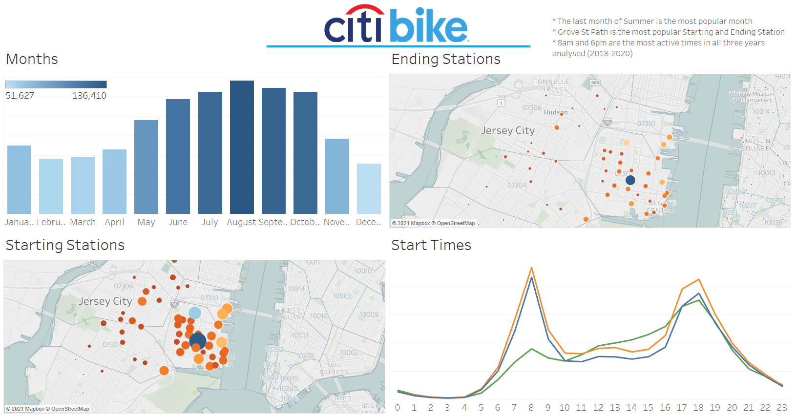
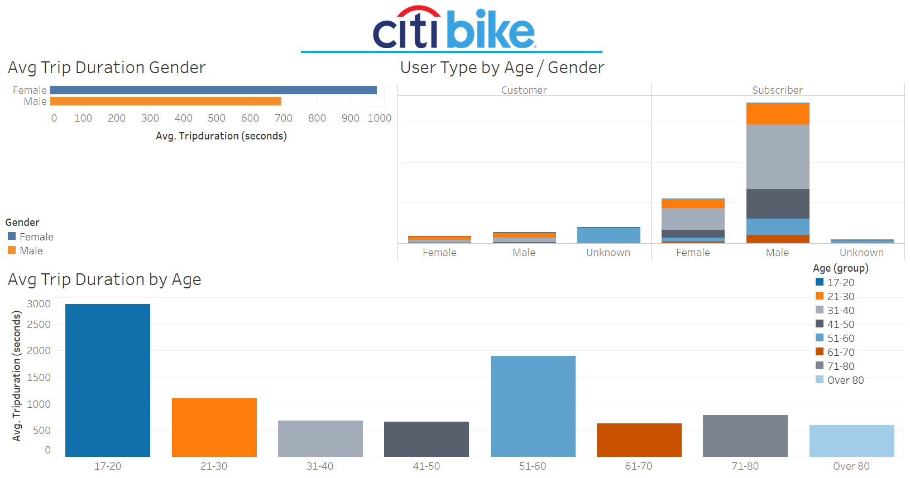
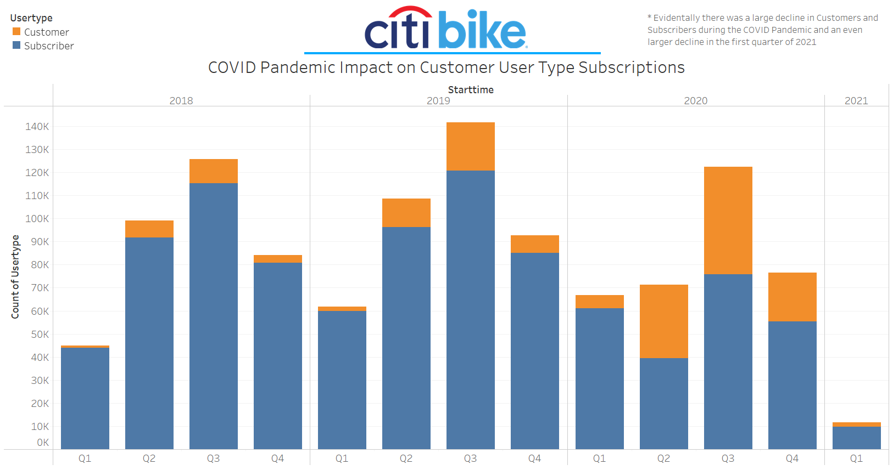

# tableau-challenge
Week 20 - Homework

## Background


Congratulations on your new job! As the new lead analyst for the [New York Citi Bike](https://en.wikipedia.org/wiki/Citi_Bike) Program, you are now responsible for overseeing the largest bike sharing program in the United States. In your new role, you will be expected to generate regular reports for city officials looking to publicize and improve the city program.

Since 2013, the Citi Bike Program has implemented a robust infrastructure for collecting data on the program's utilization. Through the team's efforts, each month bike data is collected, organized, and made public on the [Citi Bike Data](https://www.citibikenyc.com/system-data) webpage.

However, while the data has been regularly updated, the team has yet to implement a dashboard or sophisticated reporting process. City officials have a number of questions on the program, so your first task on the job is to build a set of data reports to provide the answers.

## Assignment structure
```
tableau-challenge
|__ .git                                                      # Gitignore file
|__ CitiBike_DataPreparation.ipynb                            # Jupyter notebook data clean-up file
|__ README.md                                                 # Markdown README
|__ Tableau Homework - Citi Bike Analytics.twbx               # Tableau workbook file
|__
|  |__ data/                                                  # JavaScript and CSS Styles directory
|     |__ CitiBike_Complete.csv                               # Complete Citibike csv 2018 - 2020
|     |__ JC-201801-citibike-tripdata.csv                     # Citibike Month/Year csv
|     |__ JC-201802-citibike-tripdata.csv                     # Citibike Month/Year csv
|     |__ JC-201803-citibike-tripdata.csv                     # Citibike Month/Year csv
|     |__ JC-201804-citibike-tripdata.csv                     # Citibike Month/Year csv
|     |__ JC-201805-citibike-tripdata.csv                     # Citibike Month/Year csv
|     |__ JC-201806-citibike-tripdata.csv                     # Citibike Month/Year csv
|     |__ JC-201807-citibike-tripdata.csv                     # Citibike Month/Year csv
|     |__ JC-201808-citibike-tripdata.csv                     # Citibike Month/Year csv
|     |__ JC-201809-citibike-tripdata.csv                     # Citibike Month/Year csv
|     |__ JC-201810-citibike-tripdata.csv                     # Citibike Month/Year csv
|     |__ JC-201811-citibike-tripdata.csv                     # Citibike Month/Year csv
|     |__ JC-201812-citibike-tripdata.csv                     # Citibike Month/Year csv
|     |__ JC-201901-citibike-tripdata.csv                     # Citibike Month/Year csv
|     |__ JC-201902-citibike-tripdata.csv                     # Citibike Month/Year csv
|     |__ JC-201903-citibike-tripdata.csv                     # Citibike Month/Year csv
|     |__ JC-201904-citibike-tripdata.csv                     # Citibike Month/Year csv
|     |__ JC-201905-citibike-tripdata.csv                     # Citibike Month/Year csv
|     |__ JC-201906-citibike-tripdata.csv                     # Citibike Month/Year csv
|     |__ JC-201907-citibike-tripdata.csv                     # Citibike Month/Year csv
|     |__ JC-201908-citibike-tripdata.csv                     # Citibike Month/Year csv
|     |__ JC-201909-citibike-tripdata.csv                     # Citibike Month/Year csv
|     |__ JC-201910-citibike-tripdata.csv                     # Citibike Month/Year csv
|     |__ JC-201911-citibike-tripdata.csv                     # Citibike Month/Year csv
|     |__ JC-201912-citibike-tripdata.csv                     # Citibike Month/Year csv
|     |__ JC-202001-citibike-tripdata.csv                     # Citibike Month/Year csv
|     |__ JC-202002-citibike-tripdata.csv                     # Citibike Month/Year csv
|     |__ JC-202003-citibike-tripdata.csv                     # Citibike Month/Year csv
|     |__ JC-202004-citibike-tripdata.csv                     # Citibike Month/Year csv
|     |__ JC-202005-citibike-tripdata.csv                     # Citibike Month/Year csv
|     |__ JC-202006-citibike-tripdata.csv                     # Citibike Month/Year csv
|     |__ JC-202007-citibike-tripdata.csv                     # Citibike Month/Year csv
|     |__ JC-202008-citibike-tripdata.csv                     # Citibike Month/Year csv
|     |__ JC-202009-citibike-tripdata.csv                     # Citibike Month/Year csv
|     |__ JC-202010-citibike-tripdata.csv                     # Citibike Month/Year csv
|     |__ JC-202011-citibike-tripdata.csv                     # Citibike Month/Year csv
|     |__ JC-202012-citibike-tripdata.csv                     # Citibike Month/Year csv
|__
|  |__ images/                                                # png screenshots
|     |__ Citi_Bike_logo.svg.png                              # png
|     |__ Dashboard1.PNG                                      # png
|     |__ Dashboard2.PNG                                      # png
|     |__ Dashboard3.PNG                                      # png
|     |__ story1.PNG                                          # png


```

## Usage

```
# Dependencies and Setup Jupyter Notebook
# -------------------------------------------
import pandas as pd
import numpy as np
import os
import glob

# Tableau Public 2021.2

```

## Datasets 

|No|Source|Link|
|-|-|-|
|1|CitiBike_Complete|https://github.com/alysnow/tableau-challenge/blob/main/data/CitiBike_Complete.csv|
|2|JC-201801-citibike-tripdata > JC-202012-citibike-tripdata|https://github.com/alysnow/tableau-challenge/blob/main/data|

## Task

**Your task in this assignment is to aggregate the data found in the Citi Bike Trip History Logs and find two unexpected phenomena.**

**Design 2-5 visualizations for each discovered phenomena (4-10 total). You may work with a timespan of your choosing. Optionally, you may merge multiple datasets from different periods.**

**The following are some questions you may wish to tackle. Do not limit yourself to these questions; they are suggestions for a starting point. Be creative!**

* How many trips have been recorded total during the chosen period?

* By what percentage has total ridership grown?

* How has the proportion of short-term customers and annual subscribers changed?

* What are the peak hours in which bikes are used during summer months?

* What are the peak hours in which bikes are used during winter months?

* Today, what are the top 10 stations in the city for starting a journey? (Based on data, why do you hypothesize these are the top locations?)

* Today, what are the top 10 stations in the city for ending a journey? (Based on data, why?)

* Today, what are the bottom 10 stations in the city for starting a journey? (Based on data, why?)

* Today, what are the bottom 10 stations in the city for ending a journey (Based on data, why?)

* Today, what is the gender breakdown of active participants (Male v. Female)?

* How effective has gender outreach been in increasing female ridership over the timespan?

* How does the average trip duration change by age?

* What is the average distance in miles that a bike is ridden?

* Which bikes (by ID) are most likely due for repair or inspection in the timespan?

* How variable is the utilization by bike ID?

**Next, as a chronic over-achiever:**

* Use your visualizations (does not have to be all of them) to design a dashboard for each phenomena.
* The dashboards should be accompanied with an analysis explaining why the phenomena may be occuring.

**City officials would also like to see one of the following visualizations:**

* **Basic:** A static map that plots all bike stations with a visual indication of the most popular locations to start and end a journey with zip code data overlaid on top.

* **Advanced:** A dynamic map that shows how each station's popularity changes over time (by month and year). Again, with zip code data overlaid on the map.

* The map you choose should also be accompanied by a write-up unveiling any trends that were noticed during your analysis.

**Finally, create your final presentation**

* Create a Tableau story that brings together the visualizations, requested maps, and dashboards.
* This is what will be presented to the officials, so be sure to make it professional, logical, and visually appealing.

## Considerations

Remember, the people reading your analysis will **NOT** be data analysts. Your audience will be city officials, public administrators, and heads of New York City departments. Your data and analysis needs to be presented in a way that is focused, concise, easy-to-understand, and visually compelling. Your visualizations should be colorful enough to be included in press releases, and your analysis should be thoughtful enough for dictating programmatic changes.

## Submission

Your final submission should include:

* A link to your Tableau Public workbook that includes:
  * 4-10 Total "Phenomenon" Visualizations
  * 2 Dashboards
  * 1 City Official Map
  * 1 Story
* A text or markdown file with your analysis on the phenomenons you uncovered from the data.

## Sharing Your Work
In order to share your work, we are asking that you will save your workbook as a .twbx file so that your TA's can grade them.

To save your workbook as a .twbx file, you will just need to select "Save As..." from the "File" dropdown. Then, select the .twbx option.

## Assessment

Your final product will be assessed on the following metrics:

* Analytic Rigor

* Readability

* Visual Attraction

## Citi Bike Dashboard

### Dashboard 1 - Most Active Overview

* The last month of Summer is the most popular month
* Grove St Path is the most popular Starting and Ending Station
* 8am and 6pm are the most active times in all three years analysed (2018-2020)



### Dashboard 2 - Battle of the Genders

* Females on average have longer trip durations
* The age group with the average highest trip duration is 17-20
* There appears to be a higher volume of Subscribers in the age group of 31-40



### Dashboard 3 - Pandemic

* Evidentally there was a large decline in Customers and Subscribers during the COVID Pandemic and an even larger decline in the first quarter of 2021




## Contributor
- [Alysha Snowden](https://github.com/alysnow)
